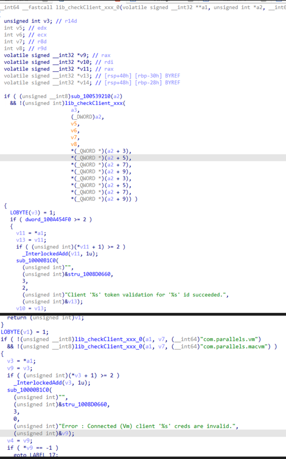
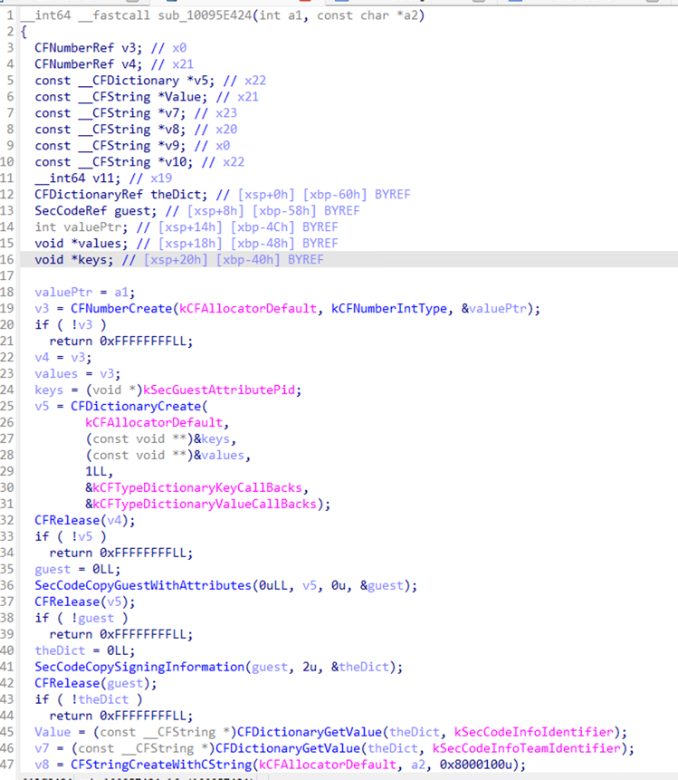
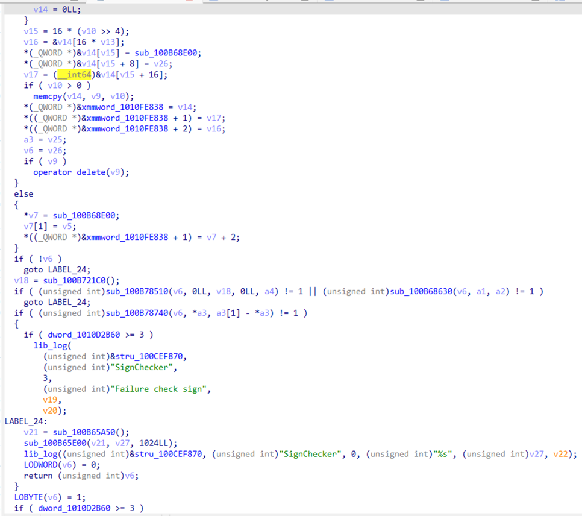
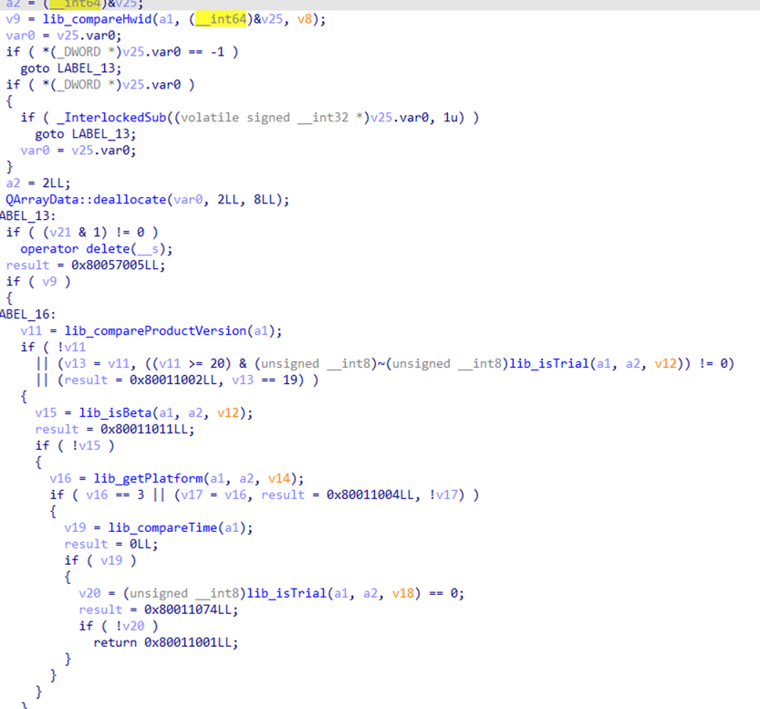

#### 一、概述
自己的电脑是mac，想用win的虚拟机，当然是pd首选。尝试白嫖一下最新版的，于是分析了一下pd。  大致就是服务端生成签名文件，客户端prl_disp_service校验中装签名，然后启动prl_vm_app。prl_vm_app也会校验签名和license文件。  

#### 二、校验
##### 1、互相校验
prl_disp_service和prl_vm_app会互相校验对方的程序签名。其中prl_disp_service校验prl_vm_app的部分如下：  

prl_vm_app校验prl_disp_service的部分如下：   

##### 2、签名校验
签名整体加载到内存校验：  

签名内容数值校验，是否是试用版，是否过期，版本是否一致、设备id是否一致（设备id是mac的硬件序列uuid值）等等  

#### 三、总结
爆破不行，prl_vm_app修改后无法向macos申请虚拟机网络权限，只能无限续杯。